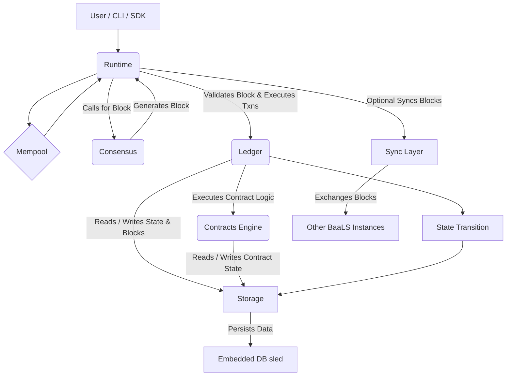

# BaaLS - Blockchain as a Local Service

## The Embeddable Ledger

BaaLS is designed to be the foundational layer for decentralized applications that prioritize local data integrity, embeddability, and optional peer-to-peer trust. Imagine a database that not only stores data but also guarantees its immutability, auditability, and deterministic processing, all within your application's local environment. This is BaaLS: a lightweight, production-grade blockchain engine written in Rust, engineered for seamless integration into desktop, mobile, and IoT applications. It's the "SQLite of blockchains" – providing a local, trustable ledger with the flexibility for optional network syncing and pluggable consensus mechanisms.

## Key Features & Differentiators

- **Single-Node, Local-First Design**: Optimized for embedded use cases, running directly within an application without requiring external network connectivity by default.
- **Optional Peer-to-Peer Syncing**: Allows BaaLS instances to synchronize their ledgers, enabling distributed local trust and data sharing among a defined set of peers.
- **Pluggable Consensus Engine**: Highly modular design allows developers to choose or implement their desired consensus mechanism (e.g., Proof-of-Authority (PoA) by default).
- **Deterministic WASM Smart Contract Runtime**: Provides a secure, isolated, and predictable environment for executing smart contracts compiled to WebAssembly (WASM), enabling language agnosticism.
- **Embedded Key-Value Store**: Utilizes `sled` (or `rocksdb`) for efficient, reliable, and persistent local data storage.
- **Comprehensive SDKs & FFI Bindings**: Offers full Software Development Kits for Rust, Go, and JavaScript, alongside Foreign Function Interface (FFI) bindings.
- **CLI Tools**: Provides robust command-line utilities for node management, wallet operations, transaction injection, and smart contract deployment.

## Impact & Use Cases

- **IoT Device Management**: Securely log sensor data, device states, and firmware updates with an immutable, auditable trail directly on the device.
- **Offline-First Applications**: Enable applications to maintain a tamper-proof local ledger, syncing when connectivity is available (e.g., supply chain tracking in remote areas, field data collection).
- **Local Data Integrity**: Provide strong guarantees for sensitive local user data in consumer applications, ensuring it hasn't been tampered with.
- **Edge Computing**: Run decentralized logic and smart contracts directly at the edge of the network, reducing latency and improving privacy.
- **Gaming & Simulations**: Create deterministic, verifiable game states or simulation environments that can be shared, replayed, and audited.
- **Personal Data Wallets**: Empower users with self-sovereign control over their data, stored and managed on a personal, auditable ledger.
- **Enterprise Micro-ledgers**: Departments or small business units can maintain their own immutable audit trails for specific processes or data.

## Core Blockchain Engine Runtime (High-Level)

The BaaLS Core Blockchain Engine is written in Rust, emphasizing modularity, determinism, and WASM smart contract execution.

### Key Modules:

- **Ledger**: Core logic for block validation, state transition, and chain integrity.
- **Consensus**: Defines `ConsensusEngine` trait and manages block generation/validation (PoA by default).
- **Storage**: Abstracted persistence layer for blocks, transactions, and state, backed by `sled` or `rocksdb`.
- **Runtime**: The central orchestrator connecting storage, consensus, ledger, and contracts; manages transaction mempool and chain execution.
- **Types**: Defines canonical data structures (Block, Transaction, ChainState, etc.).
- **Contracts**: Manages WASM smart contract sandbox and executor via WASI.
- **Sync (Optional)**: Manages peer-to-peer discovery and data synchronization.
- **CLI (External)**: Command-line tools for node management and interaction.
- **SDK (External)**: Native language bindings and FFI layers for embedding BaaLS.

### Data Flow (Minimal for Local Operation with Contract Execution):



## Quick Start

```bash
# Clone the repository
git clone https://github.com/kdsmith18542/BaaLS.git
cd BaaLS

# Build the project
cargo build

# Run the CLI
cargo run -- wallet generate
```

## Documentation

For detailed documentation, see the `docs/` directory in this repository.

## License

This project is licensed under the MIT License - see the LICENSE file for details. 
