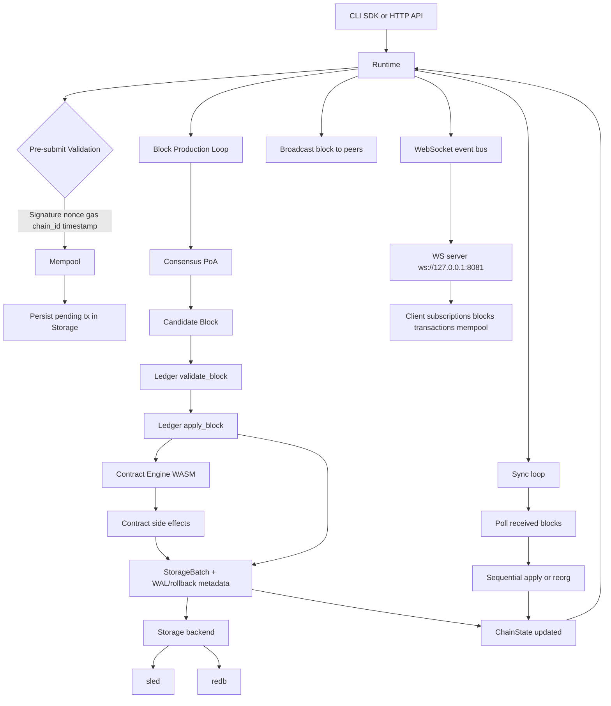

# BaaLS - Blockchain as a Local Service

BaaLS is a local-first, embeddable blockchain runtime written in Rust. It is designed for applications that need tamper-evident state transitions, deterministic execution, and optional peer sync without requiring a global public chain.

## Why BaaLS

- Local-first runtime that can run fully offline.
- Deterministic block and state transition pipeline.
- WASM smart contract execution with a constrained host interface.
- Dual storage backends: `sled` (default) and `redb`.
- Optional P2P sync layer and peer discovery support.
- CLI, HTTP API, Rust crate, and Node/Go SDK paths.

## Current Scope (Repository Status)

- Crate: `baals`
- Binary: `baalsd`
- Default consensus: PoA
- Default node/API port: `8080`
- Health endpoint: `/health` (also `/api/v1/health`)
- Storage backends: `sled` and `redb`

## Quick Start

```bash
# Clone
git clone https://github.com/anomalyco/baals.git
cd baals

# Build
cargo build --release --locked

# Initialize config
./target/release/baalsd node config init --output config.toml

# Start a node
./target/release/baalsd node start --data-dir ./data --port 8080
```

In another terminal:

```bash
# Health check
curl http://127.0.0.1:8080/health

# Create a wallet (prompts for password)
./target/release/baalsd wallet create --name alice

# Query chain head
./target/release/baalsd query head --data-dir ./data
```

## CLI Overview

Top-level command groups:

- `node`: start/stop/status/config/backup/restore
- `wallet`: key lifecycle and signing operations
- `tx`: submit/inspect/sign/validate/deploy/call flows
- `query`: blocks, txs, accounts, contract queries, mempool
- `db`: verify/migrate/compact/backup/snapshot/index utilities
- `proof`: account/contract proof generation and verification
- `p2p`: peer list/add/remove, ping, sync trigger
- `api`: token minting + convenience API calls
- `admin`: operational helpers
- `doctor`: environment/runtime diagnostics

Explore the full CLI surface:

```bash
cargo run -- --help
cargo run -- node --help
cargo run -- tx --help
```

## Runtime Data Flow

The diagram below reflects the current code path in `src/runtime.rs`, `src/ledger.rs`, and `src/cli/node.rs`.


```mermaid
graph TD
    A[CLI SDK or HTTP API] --> B[Runtime]
    B --> C{Pre-submit Validation}
    C -->|Signature nonce gas chain_id timestamp| D[Mempool]
    D --> E[Persist pending tx in Storage]

    B --> F[Block Production Loop]
    F --> G[Consensus PoA]
    G --> H[Candidate Block]
    H --> I[Ledger validate_block]
    I --> J[Ledger apply_block]

    J --> K[Contract Engine WASM]
    K --> L[Contract side effects]
    L --> M[StorageBatch + WAL/rollback metadata]
    J --> M
    M --> N[Storage backend]
    N --> O[sled]
    N --> P[redb]

    M --> Q[ChainState updated]
    Q --> B
    B --> R[Broadcast block to peers]
    B --> V[WebSocket event bus]
    V --> W[WS server ws://127.0.0.1:8081]
    W --> X[Client subscriptions blocks transactions mempool]

    B --> S[Sync loop]
    S --> T[Poll received blocks]
    T --> U[Sequential apply or reorg]
    U --> Q
```

## HTTP API Notes

Canonical API routes are under `/api/v1/*` with legacy aliases preserved.

- Read-only endpoints (health, blocks, account queries, read-only contract call) do not require a bearer token.
- Mutating endpoints require a short-lived JWT obtained from `POST /auth/token` or `POST /api/v1/auth/token`.
- Mutating endpoints are restricted to loopback clients.

## WebSocket API Notes

- WebSocket server runs on `ws://127.0.0.1:8081` by default (discoverable via `GET /health` and `GET /api/v1/health` as `ws_port`).
- Clients subscribe/unsubscribe using:
  - `{"type":"subscribe","channel":"blocks"}`
  - `{"type":"unsubscribe","channel":"blocks"}`
- Supported channels: `blocks`, `transactions`, `mempool`.
- Event frames use envelope: `{"type":"event","channel":"...","event":{...}}`.

## Project Web (baals.network)

The repository now includes a `web/` project for the public website and block explorer UI.

Quick run:

```bash
cd web
python -m http.server 4173
```

Then open `http://127.0.0.1:4173`.

The explorer is wired to:

- HTTP API: `http://127.0.0.1:8080` (default)
- WS API: `ws://127.0.0.1:8081` (default)

Both endpoints are configurable in the UI and persisted in browser local storage.

Deployment helpers included:

- GitHub Pages workflow: `.github/workflows/pages.yml`
- Domain file: `web/CNAME`
- Reverse-proxy templates: `web/deploy/nginx.conf`, `web/deploy/Caddyfile`

## Storage Backends

- `sled` (default): mature embedded KV engine.
- `redb`: copy-on-write embedded engine.

Example:

```bash
./target/release/baalsd node start --storage-backend redb --data-dir ./data-redb
```

## SDK Integration Tests

Go SDK:

```bash
cd sdk/go
go test ./...
BAALS_INTEGRATION=1 go test -run TestIntegration ./...
```

Node native SDK:

```bash
cd sdk/nodejs-native
npm run build:debug
npm run test:integration
BAALS_NODE_INTEGRATION=1 npm run test:integration
```

## Repository Layout

- `src/`: core runtime, ledger, consensus, storage, sync, CLI, FFI
- `docs/`: operational and architecture documentation
- `web/`: baals.network website + block explorer frontend
- `sdk/go`: Go SDK path
- `sdk/nodejs`: Node FFI SDK path
- `sdk/nodejs-native`: Node native addon SDK path
- `tests/`: integration and regression tests

## Documentation

Start with:

- `docs/OPERATING.md` for deployment/operations
- `docs/TLS_GUIDE.md` for TLS setup
- `docs/BaaLS_CLI_SDK_Wiring_Overview.md` for SDK/API interface details

## License

MIT. See [LICENSE](LICENSE).
